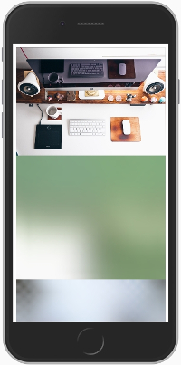

# Medium - Progressive Image Loading + Lazysizes (Lazyloading Images)

<p align="center">
  
</p>

<blockquote>Medium is a tiny, pure JavaScript library for Progressive Image Loading with a blur effect to reduce the page load time; as seen on [Medium](https://medium.com/designing-medium/image-zoom-on-medium-24d146fc0c20) and the [lazyload functionality](https://github.com/aFarkas/lazysizes). </blockquote>

### Demo

Download and extract the file and see index.html to see the demo.


### Note: Good only for non-transparent image.

### How to use

1. Link files to your site or application (add `<script>` to bottom of page)

  ```html
  <link rel="stylesheet" href="dist/css/pure-media.css">
  <script src="dist/js/pure-media.js"></script>
  ```

2. Set markup 

  ```html
  <figure class="graf-figure">
    <div class="aspectRatioPlaceholder">
      <div class="aspectRatioPlaceholder-fill"></div>
      <div class="progressiveMedia lazyload" data-width="1920" data-height="1080">
        
        
      </div>
    </div>
  </figure>
  ```

3. Add `src` small-image-path for class  `.progressiveMedia-thumbnail` 

  ```html
  
  ```

4. Set `data-src="path"` original-image-path for class `.progressiveMedia-image` 

  ```html
  
  ```

5. And finally set original image size (width, height) that you used in `data-src="path"` to `data-width` and `data-height` for class `.progressiveMedia`. For example:

  ```html
  <div class="progressiveMedia lazyload" data-width="1920" data-height="1080">
  ```


## TODO: 
- AJAX Support

Credits to <a href="https://halcyonwebdesign.com.ph/" target="_blank">Halcyon Web Design</a> for development time.
<br>
